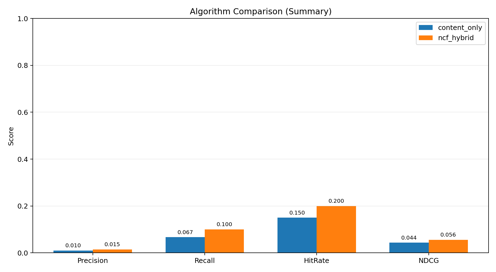
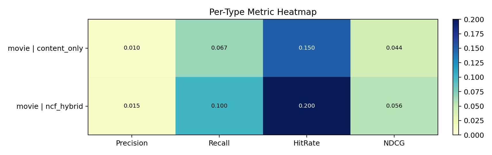

# 推荐算法对比报告

- 生成时间: 2026-03-09 17:25:37
- Top-K: 20
- Trials: 20
- Test Ratio: 0.2
- TensorFlow 可用: True
- 图表可用: True

## 数据概况

- 电影候选数: 432
- 剧集候选数: 801
- 电影交互数: 17
- 剧集交互数: 0
- 跳过类型: series

## 总览指标（Summary）

| type | algorithm | precision@k | recall@k | f1@k | hit_rate@k | ndcg@k | map@k | mrr@k | coverage@k | folds |
| --- | --- | --- | --- | --- | --- | --- | --- | --- | --- | --- |
| all | content_only | 0.0100 | 0.0667 | 0.0174 | 0.1500 | 0.0437 | 0.0215 | 0.0583 | 0.0903 | 20 |
| all | ncf_hybrid | 0.0150 | 0.1000 | 0.0261 | 0.2000 | 0.0560 | 0.0252 | 0.0617 | 0.0880 | 20 |

## 分类型指标（Per Type）

| type | algorithm | precision@k | recall@k | f1@k | hit_rate@k | ndcg@k | map@k | mrr@k | coverage@k | folds |
| --- | --- | --- | --- | --- | --- | --- | --- | --- | --- | --- |
| movie | content_only | 0.0100 | 0.0667 | 0.0174 | 0.1500 | 0.0437 | 0.0215 | 0.0583 | 0.0903 | 20 |
| movie | ncf_hybrid | 0.0150 | 0.1000 | 0.0261 | 0.2000 | 0.0560 | 0.0252 | 0.0617 | 0.0880 | 20 |

## 结论说明

- 推荐系统中的“准确率”通常用 `Precision@K` 和 `HitRate@K` 表示。
- 如果 `ncf_hybrid` 的 folds 很低，说明当前 NCF 训练在多次切分里失败率较高。
- 当前报告属于离线评估，后续可结合在线 A/B 测试做业务验证。
