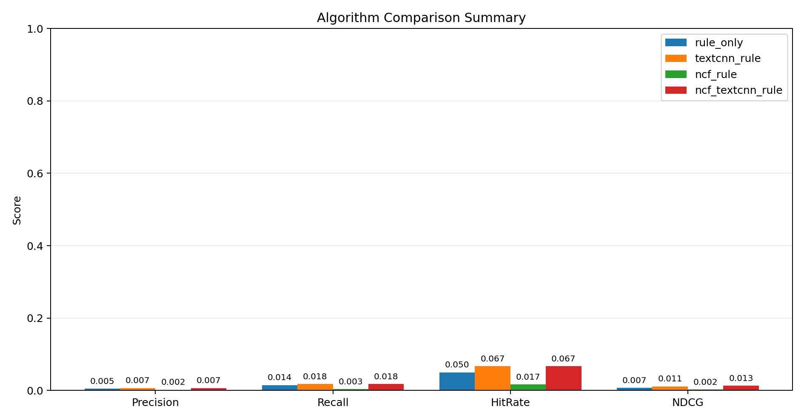
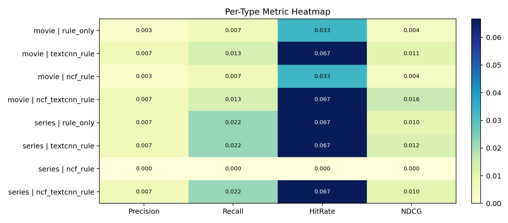

# Recommender Offline Comparison Report

- Generated at: 2026-03-24 16:11:14
- Top-K: 10
- Trials: 30
- Test ratio: 0.2
- Algorithms: rule_only, textcnn_rule, ncf_rule, ncf_textcnn_rule
- TensorFlow available: True
- TextCNN available: True
- Plot available: True

## Data Overview

- Movie items: 432
- Series items: 801
- Movie interactions: 27
- Series interactions: 15

## Summary

| type | algorithm | precision@k | recall@k | f1@k | hit_rate@k | ndcg@k | map@k | mrr@k | coverage@k | folds |
| --- | --- | --- | --- | --- | --- | --- | --- | --- | --- | --- |
| all | rule_only | 0.0050 | 0.0144 | 0.0074 | 0.0500 | 0.0071 | 0.0021 | 0.0075 | 0.0564 | 60 |
| all | textcnn_rule | 0.0067 | 0.0178 | 0.0096 | 0.0667 | 0.0114 | 0.0044 | 0.0174 | 0.3355 | 60 |
| all | ncf_rule | 0.0017 | 0.0033 | 0.0022 | 0.0167 | 0.0022 | 0.0007 | 0.0033 | 0.3686 | 60 |
| all | ncf_textcnn_rule | 0.0067 | 0.0178 | 0.0096 | 0.0667 | 0.0132 | 0.0057 | 0.0255 | 0.3844 | 60 |

## Per Type

| type | algorithm | precision@k | recall@k | f1@k | hit_rate@k | ndcg@k | map@k | mrr@k | coverage@k | folds |
| --- | --- | --- | --- | --- | --- | --- | --- | --- | --- | --- |
| movie | rule_only | 0.0033 | 0.0067 | 0.0044 | 0.0333 | 0.0044 | 0.0013 | 0.0067 | 0.0741 | 30 |
| movie | textcnn_rule | 0.0067 | 0.0133 | 0.0089 | 0.0667 | 0.0105 | 0.0041 | 0.0204 | 0.4213 | 30 |
| movie | ncf_rule | 0.0033 | 0.0067 | 0.0044 | 0.0333 | 0.0044 | 0.0013 | 0.0067 | 0.4514 | 30 |
| movie | ncf_textcnn_rule | 0.0067 | 0.0133 | 0.0089 | 0.0667 | 0.0162 | 0.0083 | 0.0417 | 0.4954 | 30 |
| series | rule_only | 0.0067 | 0.0222 | 0.0103 | 0.0667 | 0.0099 | 0.0028 | 0.0083 | 0.0387 | 30 |
| series | textcnn_rule | 0.0067 | 0.0222 | 0.0103 | 0.0667 | 0.0123 | 0.0048 | 0.0144 | 0.2497 | 30 |
| series | ncf_rule | 0.0000 | 0.0000 | 0.0000 | 0.0000 | 0.0000 | 0.0000 | 0.0000 | 0.2859 | 30 |
| series | ncf_textcnn_rule | 0.0067 | 0.0222 | 0.0103 | 0.0667 | 0.0103 | 0.0031 | 0.0093 | 0.2734 | 30 |

## Notes

- `ncf_textcnn_rule` matches the current production main path.
- `ncf_rule` approximates the fallback when TextCNN is unavailable.
- `textcnn_rule` approximates the fallback when NCF is unavailable.
- `rule_only` approximates the last fallback based on rule content similarity.
